# Orchestration de microservices avec Spring Cloud, Eureka, Gateway et OpenFeign


Ce projet est une architecture de microservices utilisant Spring Cloud pour démontrer l'orchestration de services avec :
- **Eureka Server** : Service de découverte et registre des microservices
- **Spring Cloud Gateway** : API Gateway pour le routage des requêtes
- **OpenFeign** : Client HTTP déclaratif pour la communication inter-services
- **Microservices** : Service Client et Service Voiture

## Architecture

Le projet est composé de 4 modules principaux :

### 1. Eureka Server (Port 8761)
Serveur de découverte qui permet l'enregistrement et la découverte automatique des microservices.

**Configuration :**
```properties
spring.application.name=eureka-server
server.port=8761
eureka.client.register-with-eureka=false
eureka.client.fetch-registry=false
```

### 2. Service Client (Port 8088)
Microservice gérant les clients avec les entités Client.

**Configuration :**
```properties
spring.application.name=SERVICE-CLIENT
server.port=8088
eureka.client.service-url.defaultZone=http://localhost:8761/eureka/
```

### 3. Service Voiture (Port 8089)
Microservice gérant les voitures et utilisant OpenFeign pour communiquer avec le Service Client.

**Configuration :**
```properties
spring.application.name=SERVICE-VOITURE
server.port=8089
spring.cloud.discovery.enabled=true
```

### 4. Gateway (Port 8888)
API Gateway qui route les requêtes vers les microservices appropriés.

**Configuration des routes :**
```yaml
spring:
  cloud:
    gateway:
      routes:
        - id: r1
          uri: "http://localhost:8088"
          predicates:
            - Path=/clients/**
        - id: r2
          uri: "http://localhost:8088"
          predicates:
            - Path=/client/**
        - id: r3
          uri: "http://localhost:8089"
          predicates:
            - Path=/voitures/**
```

## Démarrage de l'application

### Ordre de démarrage des services :

1. **Eureka Server** (port 8761)
2. **Service Client** (port 8088)
3. **Service Voiture** (port 8089)
4. **Gateway** (port 8888)

## Captures d'écran

### 1. Service Client - Démarrage
Le service Client démarre sur le port 8088 et s'enregistre auprès d'Eureka.

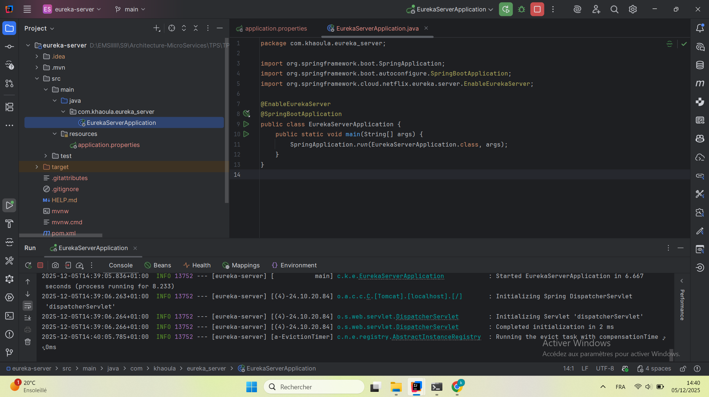

### 2. Données des Clients
Liste des clients disponibles via l'endpoint `/clients`.

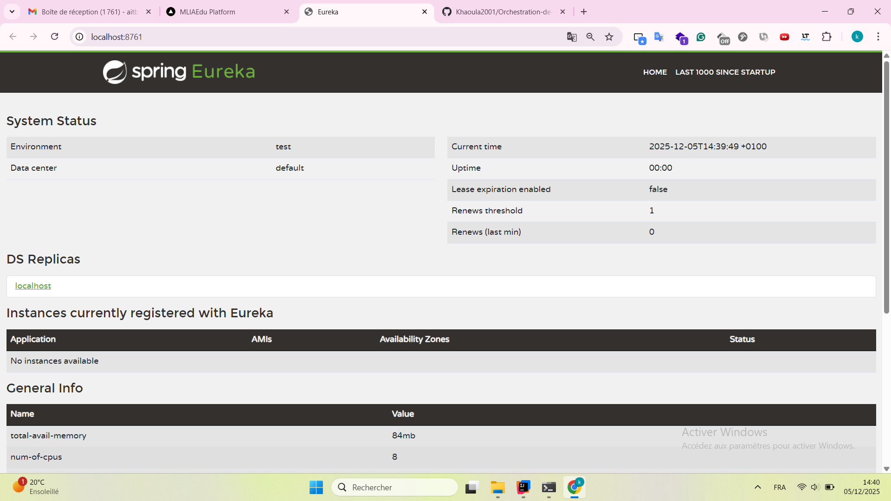

### 3. Client par ID
Récupération d'un client spécifique via l'endpoint `/client/1`.

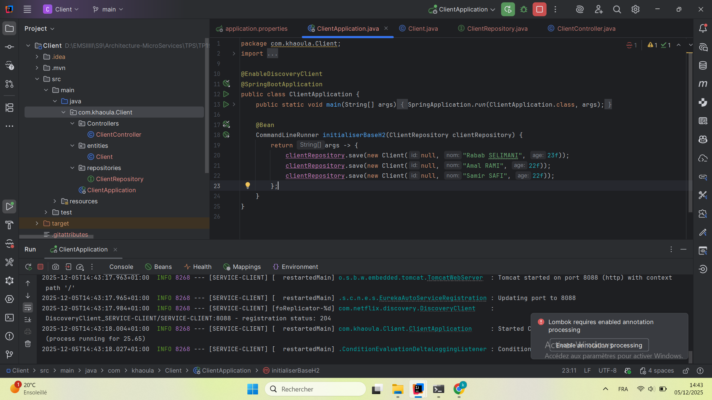

### 4. Eureka Dashboard
Interface de monitoring d'Eureka montrant les services enregistrés (SERVICE-CLIENT).

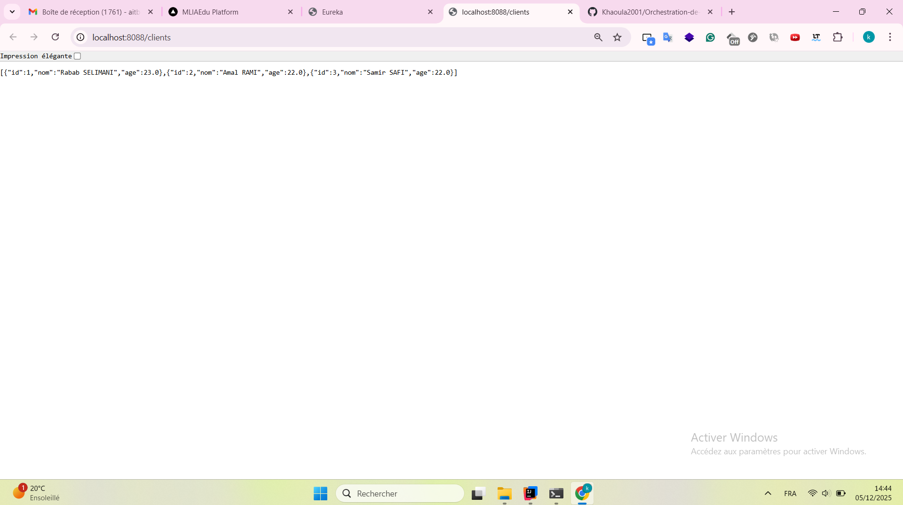

### 5. Eureka - Instances enregistrées
Vue détaillée des instances de SERVICE-CLIENT enregistrées sur Eureka.

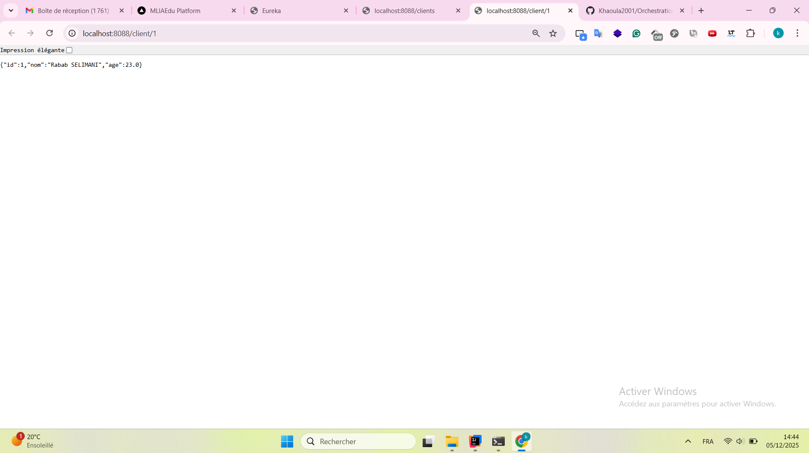

### 6. Eureka - Informations système
Informations générales sur l'état du système Eureka.

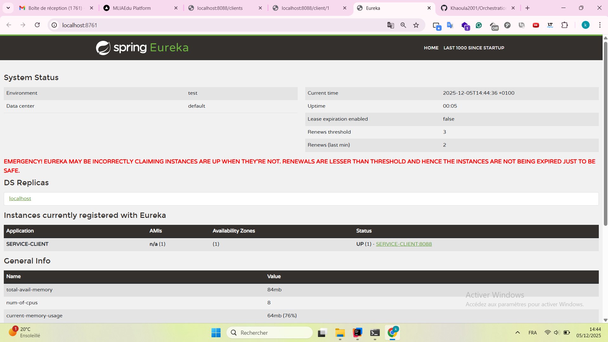

### 7. Gateway - Configuration
Configuration du Gateway avec les routes vers les microservices.

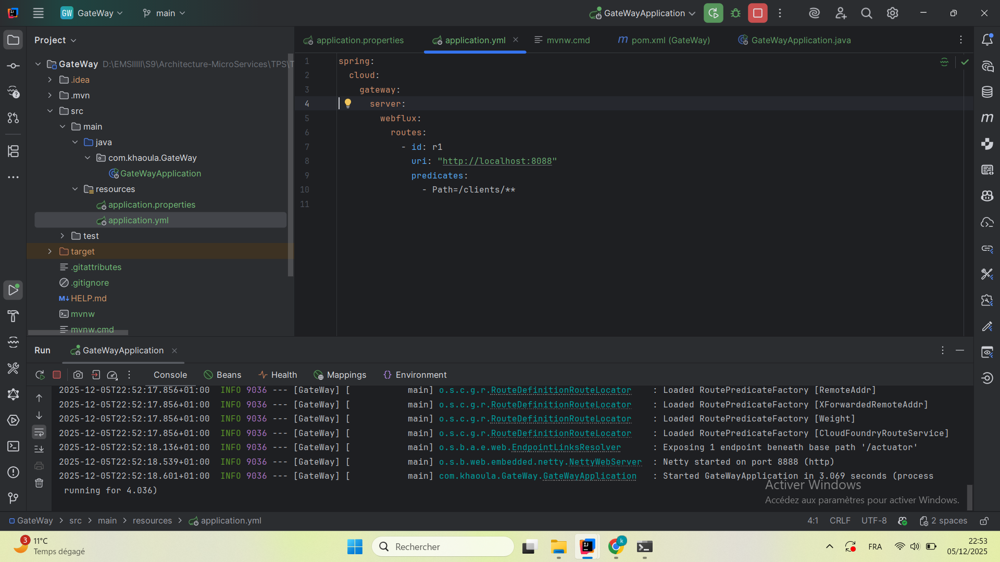

### 8. Gateway - Démarrage
Démarrage du Gateway sur le port 8888 avec connexion à Eureka.

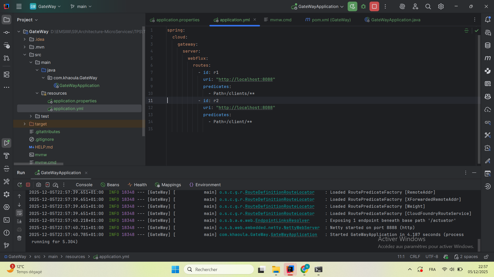

### 9. Client via Gateway
Accès au client via le Gateway à l'URL `http://localhost:8888/client/1`.

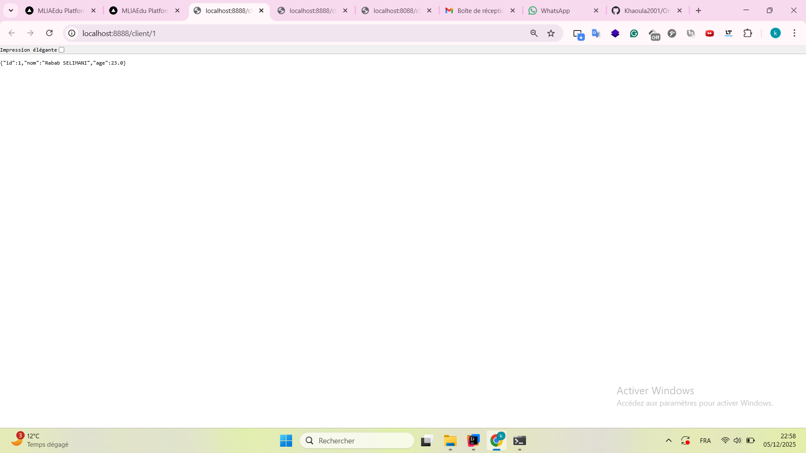

### 10. Service Voiture - Données
Liste des clients retournée via le Service Voiture (démonstration de la communication inter-services).

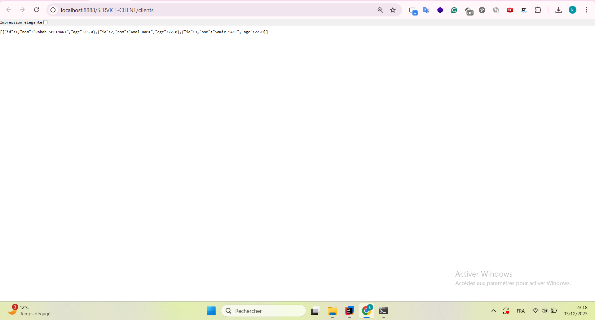

### 11. Service Voiture via Gateway
Accès aux données via le Gateway à l'URL `http://localhost:8888/SERVICE-CLIENT/clients`.

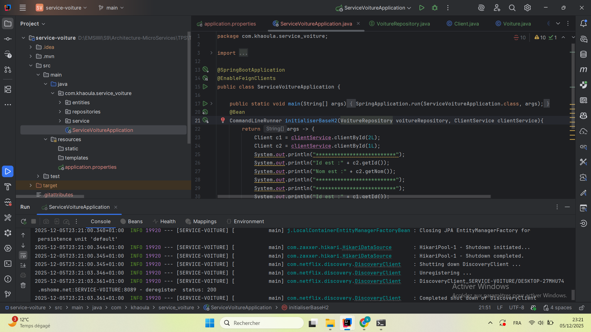

## Technologies utilisées

- **Java** 
- **Spring Boot** 
- **Spring Cloud Netflix Eureka** - Service Discovery
- **Spring Cloud Gateway** - API Gateway
- **Spring Cloud OpenFeign** - Client HTTP déclaratif
- **Maven** - Gestion des dépendances

## Endpoints disponibles

### Via Gateway (Port 8888)

#### Service Client
- `GET http://localhost:8888/clients` - Liste tous les clients
- `GET http://localhost:8888/client/{id}` - Récupère un client par ID

#### Service Voiture
- `GET http://localhost:8888/voitures` - Liste toutes les voitures

### Accès direct

#### Service Client (Port 8088)
- `GET http://localhost:8088/clients` - Liste tous les clients
- `GET http://localhost:8088/client/{id}` - Récupère un client par ID

#### Service Voiture (Port 8089)
- `GET http://localhost:8089/voitures` - Liste toutes les voitures

#### Eureka Server (Port 8761)
- `GET http://localhost:8761` - Dashboard Eureka

## Fonctionnalités démontrées

1. **Service Discovery** : Les microservices s'enregistrent automatiquement auprès d'Eureka
2. **Load Balancing** : Répartition des charges entre les instances
3. **API Gateway** : Point d'entrée unique pour tous les microservices
4. **Communication inter-services** : Utilisation d'OpenFeign pour appeler d'autres microservices
5. **Routage dynamique** : Configuration des routes dans le Gateway


